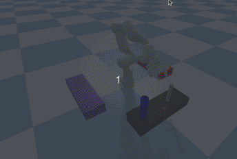
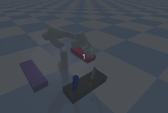

# franka_pybullet
Franka Panda robot motion demos based on pybullet
# Introduction
Here is my first franka pybullet demo! This demo is based on my first package *'franka_tools'*, which contains actions widely used by manipulator, such as 'pick', 'place' and 'press'
(Maybe more in the future).   
# Dependencies
`pip install pybullet_planning numpy pybullet`
# Action demo
## pick&place
   
## press

## full demo video
logs/videos/grasp_demo02.mp4
